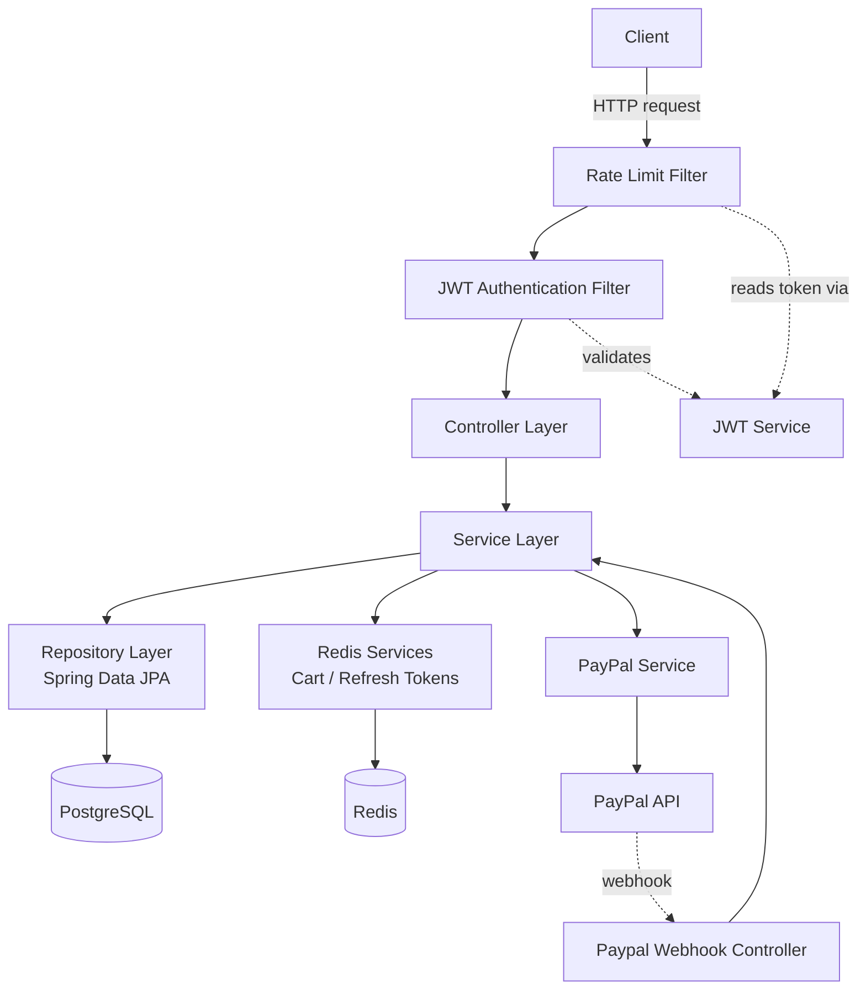
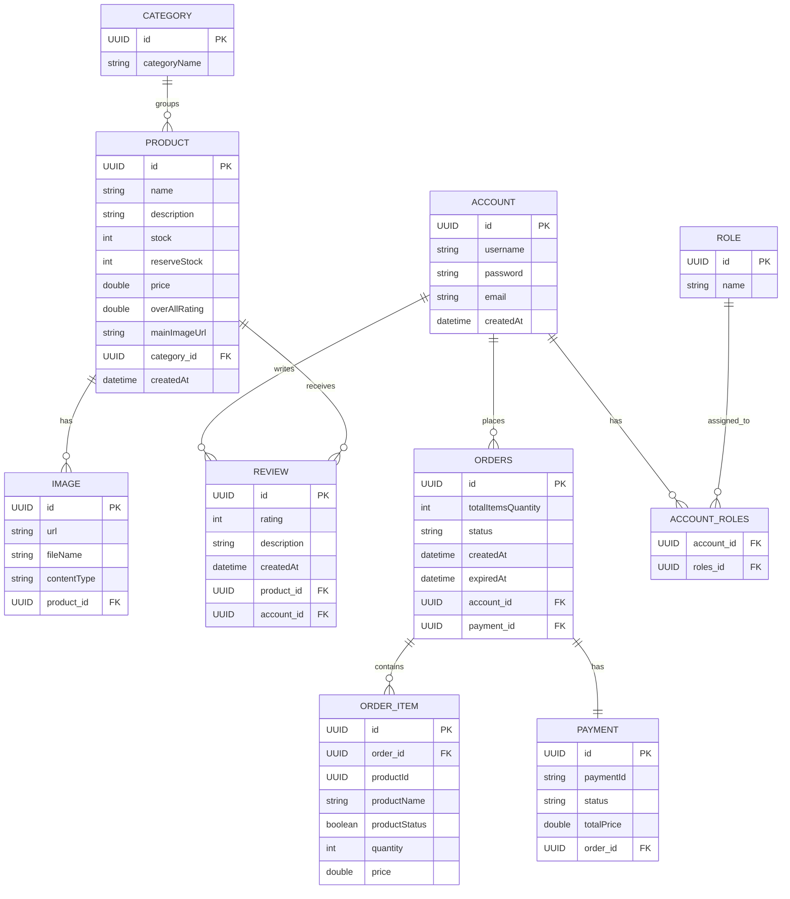
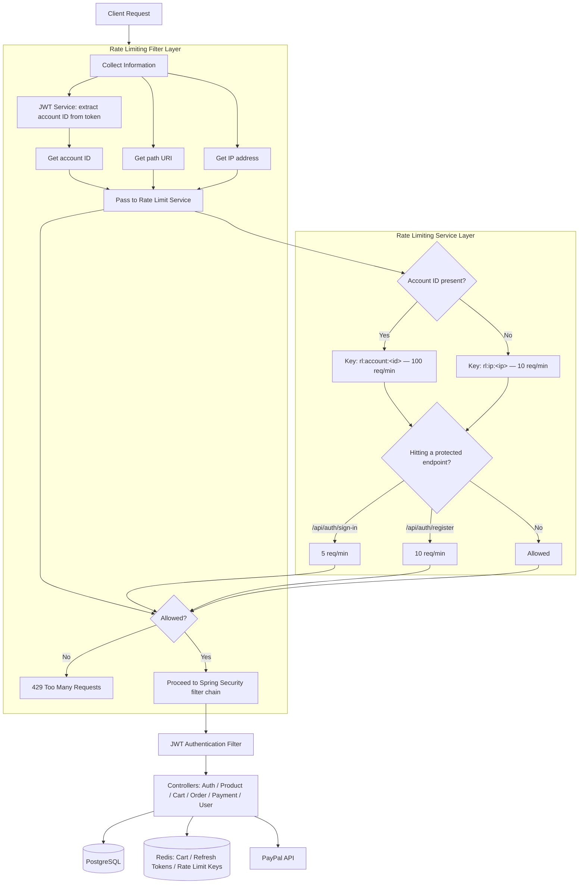
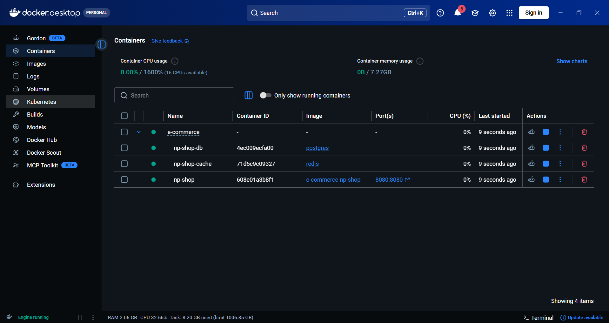
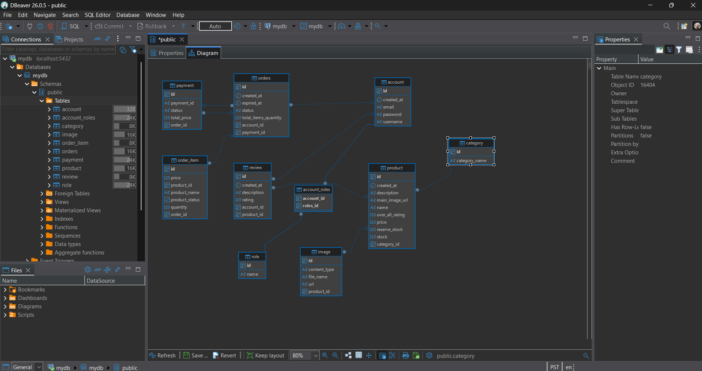

<div align="center">

# ⚙︎ NP-Shop API

**A Spring Boot e-commerce backend with JWT auth, Redis-backed rate limiting, PayPal payments, and PostgreSQL persistence.**

[](https://www.java.com/)
[](https://spring.io/projects/spring-boot)
[](https://spring.io/projects/spring-security)
[](https://www.postgresql.org/)
[](https://redis.io/)
[](https://redisson.org/)
[](https://github.com/jwtk/jjwt)
[](https://developer.paypal.com/)
[](https://www.docker.com/)
[](https://maven.apache.org/)
[](https://projectlombok.org/)

</div>

---

## ✎ Overview

**NP-Shop** is a REST API for an e-commerce platform built with **Spring Boot 3.5.14** and **Java 21**. It handles accounts/roles, products & categories, image uploads, reviews, a Redis-backed shopping cart, order processing, and PayPal checkout — all sitting behind a custom **JWT authentication layer** and a **Redis-powered sliding-window rate limiter**.

---

## ▶︎ Quick Start

```bash
git clone https://github.com/julhariemaddin/np-shop.git
cd np-shop

# create your .env file (see Environment Variables below)
cp .env.example .env

docker compose -f Docker-compose.yml up -d --build
```

The API is now running at `http://localhost:8080`.

---

## ⚒︎ Tech Stack

| Layer | Technology |
|---|---|
| **Language / Runtime** |  |
| **Framework** |    |
| **Database** |  |
| **Cache / Rate Limiting** |   |
| **Auth** |  |
| **Payments** |  |
| **Build Tool** |  |
| **Boilerplate** |  |
| **Containerization** |   |
| **Validation** |  |

---

## ⌂ Architecture

NP-Shop follows a **layered architecture** with clear separation of concerns — each layer only talks to the one directly below it:

```
Controller  →  Service  →  Repository  →  Database
```

> This is a **layered Spring architecture**, not strict Clean Architecture / Hexagonal Architecture — there's no dedicated domain layer that's fully isolated from framework concerns (entities are JPA-annotated, services depend on Spring beans directly, etc.). For a project this size, layered architecture is the right level of structure: it keeps responsibilities separated without the overhead of ports/adapters.



**Flow summary:**
1. Every request passes through the **Rate Limit Filter** (account/IP/endpoint buckets via Redisson) and the **JWT Authentication Filter** (validates the bearer token and loads the account).
2. The **Controller** receives the validated request and delegates to a **Service**.
3. The **Service** holds the business logic and talks to:
   - **Repository** (Spring Data JPA) for persistent data in **PostgreSQL**
   - **Redis services** for ephemeral data (cart contents, refresh tokens)
   - **PayPal service** for checkout sessions, with PayPal calling back into the **webhook controller** to confirm payment status

---

## ✦ Features

- ⚿ **JWT-based authentication** — register / sign-in, refresh tokens stored in Redis
- ▣ **Product catalog** — categories, images, search, reviews & auto-calculated ratings
- ⛁ **Redis-backed cart** — fast, ephemeral cart storage per account
- ☐ **Order management** — order items, pending-payment expiry scheduler
- ⌁ **PayPal integration** — checkout flow + webhook handling
- ⧗ **Custom rate limiting** — per-account, per-IP, and per-endpoint limits via Redisson
- ✎ **Account/profile management** — update profile & password
- ⚙︎ **Dockerized** — multi-stage build, Compose stack with Postgres + Redis

---

## ▣ Entity Relationship Diagram



> `ACCOUNT_ROLES` is the JPA `@ManyToMany` join table between `Account` and `Role`.

---

## ⇉ Application Request Flow



This mirrors the rate-limiting diagram for the project: the **filter layer** gathers the account ID (from the JWT, if present), the request path, and the IP; it then hands those off to the **service layer**, which checks an account- or IP-level bucket first, and — only for `/api/auth/sign-in` and `/api/auth/register` — an additional per-endpoint bucket, all backed by Redisson `RRateLimiter`s.

---

## ⧗ Rate Limiting

| Scope | Key prefix | Limit |
|---|---|---|
| Authenticated account (global) | `rl:account:<accountId>` | 100 requests / minute |
| Unauthenticated IP (global) | `rl:ip:<ip>` | 10 requests / minute |
| `POST /api/auth/sign-in` | `rl:endpoint:<accountId or ip>` | 5 requests / minute |
| `POST /api/auth/register` | `rl:endpoint:<accountId or ip>` | 10 requests / minute |

If a token is present, the user's ID is extracted from the JWT and rate-limited by **account**. If not, the request falls back to **IP-based** limiting. Either way, exceeding a bucket returns:

```json
{ "code": 429, "message": "Too many requests" }
```

---

## ⌁ API Examples

### `POST /api/auth/register`

Request:
```json
{
  "username": "julharie",
  "password": "StrongPass1!",
  "email": "julharie@example.com"
}
```

Response `200 OK`:
```json
{
  "id": "f3a1c9e2-1b2d-4c3e-8a9f-2d3e4f5a6b7c",
  "username": "julharie",
  "email": "julharie@example.com"
}
```

### `POST /api/auth/sign-in`

Request:
```json
{
  "username": "julharie",
  "password": "StrongPass1!"
}
```

Response `200 OK`:
```json
{
  "token": "eyJhbGciOiJIUzI1NiIsInR5cCI6IkpXVCJ9...",
  "refreshToken": "8f14e45f-ceea-467e-bd9d-1a2b3c4d5e6f",
  "username": "julharie",
  "role": ["ROLE_USER"],
  "email": "julharie@example.com"
}
```

### `GET /api/v1/product`

Response `200 OK` (paginated):
```json
{
  "content": [
    {
      "id": "9b2c1d3e-...",
      "name": "Wireless Mouse",
      "description": "Ergonomic 2.4GHz wireless mouse",
      "stock": 42,
      "price": 19.99,
      "mainImage": { "url": "https://.../mouse.jpg" },
      "categoryId": "c1a2b3...",
      "numberOfReviews": 12,
      "overAllRating": 4.5
    }
  ],
  "totalElements": 1,
  "totalPages": 1
}
```

### `POST /api/v1/order`

Requires `Authorization: Bearer <token>`. Creates an order from the account's current Redis cart — no request body needed.

Response `200 OK`:
```json
{
  "id": "a1b2c3d4-...",
  "status": "PENDING",
  "totalItemsQuantity": 2,
  "totalPrice": 39.98,
  "createdAt": "2026-06-23T10:15:00"
}
```

Rate-limited response `429 Too Many Requests`:
```json
{
  "code": 429,
  "message": "Too many requests"
}
```

---

## ⌁ API Endpoints

| Method | Endpoint | Description |
|---|---|---|
| `POST` | `/api/auth/register` | Register a new account |
| `POST` | `/api/auth/sign-in` | Authenticate and receive a JWT |
| `POST` | `/request` | Refresh access token |
| `GET` | `/api/users/me` | Get current profile |
| `PATCH` | `/api/users/me/profile` | Update profile |
| `PATCH` | `/api/users/me/password` | Update password |
| `GET/POST/PUT/DELETE` | `/api/v1/product` | Product CRUD, search, reviews |
| `GET/POST/PUT/DELETE` | `/api/v1/category` | Category CRUD |
| `GET/POST/DELETE` | `/api/v1/cart` | Cart management (Redis-backed) |
| `GET/POST/DELETE` | `/api/v1/order` | Order placement & retrieval |
| `GET/POST/DELETE` | `/api/v1/image` | Product image upload/retrieval |
| `*` | `/api/v1/paypal/**` | PayPal checkout + webhook |
| `GET` | `/api/v1/server/check` | Health check |

---

## ⚿ Configuration

The app uses Spring profiles: **`dev`** (local) and **`docker`** (containerized), both reading secrets from environment variables.

### Environment Variables

| Variable | Used by | Description |
|---|---|---|
| `JWT_SECRET` | All profiles | Secret key used to sign/verify JWTs |
| `JWT_TOKEN_EXPIRATION` | All profiles | Access token lifetime (ms) |
| `PAYPAL_CLIENT_ID` | All profiles | PayPal app client ID |
| `PAYPAL_CLIENT_SECRET` | All profiles | PayPal app client secret |
| `PAYPAL_WEBHOOK_ID` | All profiles | PayPal webhook ID for signature verification |
| `PAYPAL_IS_SANDBOX` | All profiles | `true` for sandbox, `false` for production |
| `PAYPAL_RETURN_URL` | All profiles | Redirect URL after successful checkout |
| `PAYPAL_CANCEL_URL` | All profiles | Redirect URL after cancelled checkout |
| `DOCK_JDBC_POSTGRES_DB` | `docker` profile | Postgres JDBC URL (e.g. `jdbc:postgresql://postgres:5432/mydb`) |
| `DOCK_POSTGRES_USERNAME` | `docker` profile | Postgres username |
| `DOCK_POSTGRES_PASSWORD` | `docker` profile | Postgres password |
| `DOCK_REDIS_PASSWORD` | `docker` profile | Redis password |
| `DEV_JDBC_POSTGRES_DB` | `dev` profile | Postgres JDBC URL for local development |
| `DEV_POSTGRES_USERNAME` | `dev` profile | Postgres username (local) |
| `DEV_POSTGRES_PASSWORD` | `dev` profile | Postgres password (local) |
| `DEV_REDIS_PASSWORD` | `dev` profile | Redis password (local) |

`.env.example` (copy to `.env` and fill in):

```env
JWT_SECRET=
JWT_TOKEN_EXPIRATION=

PAYPAL_CLIENT_ID=
PAYPAL_CLIENT_SECRET=
PAYPAL_WEBHOOK_ID=
PAYPAL_IS_SANDBOX=true
PAYPAL_RETURN_URL=
PAYPAL_CANCEL_URL=

DOCK_JDBC_POSTGRES_DB=jdbc:postgresql://postgres:5432/mydb
DOCK_POSTGRES_USERNAME=admin
DOCK_POSTGRES_PASSWORD=password
DOCK_REDIS_PASSWORD=StrongPassword
```

> **Note:** The Postgres/Redis container **definitions** in `Docker-compose.yml` currently set their own credentials directly (`POSTGRES_PASSWORD: password`, `--requirepass StrongPassword`). For these to come from `.env` too, reference the same variables there, e.g.:
> ```yaml
> redis:
>   command: ["redis-server", "--requirepass", "${DOCK_REDIS_PASSWORD}"]
> postgres:
>   environment:
>     POSTGRES_PASSWORD: ${DOCK_POSTGRES_PASSWORD}
> ```

---

## ⛁ Deployment

For local Docker usage, see **Quick Start** above. For longer-running or server deployments, run detached and check status/logs separately:

```bash
# Start in the background
docker compose -f Docker-compose.yml up -d --build

# Check container status
docker compose -f Docker-compose.yml ps

# Tail logs
docker compose -f Docker-compose.yml logs -f np-shop

# Stop everything
docker compose -f Docker-compose.yml down
```

The API will be available at `http://localhost:8080`.

> For production, swap the hardcoded Postgres/Redis credentials in `Docker-compose.yml` for `.env`-driven values (see the note in **Configuration** above), and consider a managed Postgres/Redis instance instead of the bundled containers.

---

## ▶︎ Running Locally (dev profile)

```bash
# Requires a running local Postgres and Redis instance
export DEV_JDBC_POSTGRES_DB=jdbc:postgresql://localhost:5432/mydb
export DEV_POSTGRES_USERNAME=admin
export DEV_POSTGRES_PASSWORD=password
export DEV_REDIS_PASSWORD=yourpassword
export JWT_SECRET=changeme
export JWT_TOKEN_EXPIRATION=3600000

./mvnw spring-boot:run
```

---

## ☐ Screenshots


**Docker containers running:**
```
docker compose -f Docker-compose.yml ps
```


**Database schema (DBeaver ER view):**


**API documentation (Swagger UI):**
> Not currently included in `pom.xml`. To add it:
> ```xml
> <dependency>
>     <groupId>org.springdoc</groupId>
>     <artifactId>springdoc-openapi-starter-webmvc-ui</artifactId>
>     <version>2.6.0</version>
> </dependency>
> ```
> Once added, Swagger UI will be available at `http://localhost:8080/swagger-ui.html`.
> 

---

## ⌂ Project Structure

```
np-shop/
├── controller/        # REST controllers (auth, products, cart, orders, users...)
├── service/            # Business logic (products, orders, categories, payments)
├── redis/              # Redis-backed services (cart, refresh tokens)
├── rate_limit/         # RateLimitFilter + RateLimitService (Redisson)
├── security/           # JWT service, filters, account details
├── payment/paypal/     # PayPal SDK config, service, controller, webhook
├── entity/             # JPA entities
├── repo/                # Spring Data JPA repositories
├── dto/                # Request/response DTOs
├── exception/          # Custom exceptions + global handler
└── scheduler/          # Pending-payment order expiry job
```

---

## ✎ Author

**Julharie M. Maddin**
[GitHub @julhariemaddin](https://github.com/julhariemaddin)

---

<div align="center">

Built with ☕︎ & ⚙︎ Spring Boot

</div>
